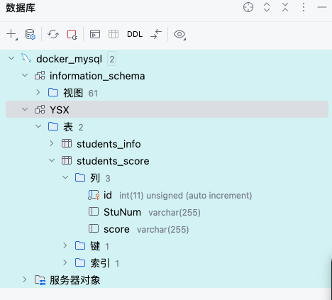

## 配置.env
- 将env.template修改为.env

## 启动和配置mysql数据库, 建表,连接mysql
- 启动docker
- 打开docker命令行终端，进入到mysql_config/docker-compose.yaml文件所在的目录，运行指令 docker-compose up -d                
- 启动成功后，通过数据库客户端软件连接到本地数据库，并将students_info.sql和students_score.sql文件导入到数据库中作为测试数据表
- 

## 运行client.py 和 server.py
- cd 到stdio目录
- 运行python server.py
- 运行python client.py

## 测试集
测试问题，可参考如下:                                
- (1)有哪些表可以使用                                             
- (2)查询学生信息表中数据                                                   
- (3)查询学生成绩表中数据                                               
- (4)查询学生成绩表中分数最高的                                              
- (5)对学生信息表和学生成绩表进行联表查询，生成每个学生姓名、成绩                     
- (6)将学生姓名为张三的改为钱八，并获取最新的信息表