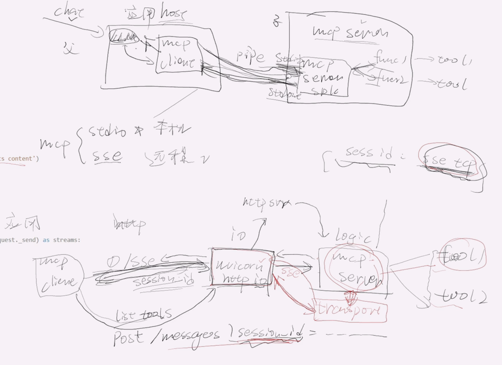

## 原理图

## 原理解释
1. 客户端建立sse连接, 回包中包含session_id(str), 这个id是mcp server中维护的一个一个射表: session_id 与 sse连接的关系. 实际上这条连接一旦建立,就不会断开了.
   - mcp client    ---1️⃣sse(http)-->         uvicorn http (io层)     ---转发--->  mcp server(逻辑层) --- 分发---> tools
   - mcp client    <---返回session_id---         uvicorn http (io层)     <------  mcp server(逻辑层) <------ tools

2. 客户端调用工具,根据session_id找到sse连接推送结果:客户端发起post请求,请求的endpoint是/messages?session_id, 会携带session_id请求参数,映射表找到session_id对应的sse连接, 然后逻辑层执行tool,将结果推给io层,再继续推给sse长连接,一直到客户端.
   - mcp client    ---2️⃣调用工具,发起post请求,携带session_id --->   uvicorn http (io层)  ---转发--->  mcp server(逻辑层) --- 映射表找到session_id对应的sse连接---> tools 
   - mcp client    <---由SSE长连接推送结果---  uvicorn http (io层)  <---推送---  mcp server(逻辑层) <---执行tool,返回结果--- tools

## 运行
- cd 到 mcp_sse文件夹,
- 运行python sse_server.py, 根据起的服务地址,再去客户端中请求
- 运行python sse_client.py,输入baidu.com抓取页面内容 